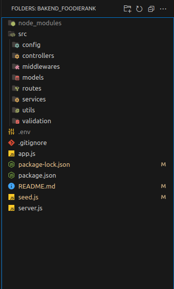

# FoodieRank - Backend API 🍜
Este repositorio contiene el backend de FoodieRank, una aplicación full-stack desarrollada con Node.js y Express. El objetivo del proyecto es permitir a los usuarios registrar, calificar y rankear restaurantes y platos.

Este backend expone una API RESTful que gestiona usuarios (con roles y autenticación JWT), restaurantes, platos, categorías y reseñas. Incluye un sistema de ranking ponderado y utiliza transacciones de MongoDB para operaciones críticas.

## Tecnologías Utilizadas
- **Node.js**

- **Framework:** Express.js

- **Base de Datos:** MongoDB

- **Autenticación:** JSON Web Tokens (JWT) con passport-jwt y jsonwebtoken

- **Seguridad:** bcrypt (para hashing de contraseñas) y express-rate-limit (para limitar peticiones)

- **Validación:** express-validator (para validar los datos de entrada en los endpoints)

- **Documentación:** swagger-ui-express (para la documentación interactiva de la API)

- **Variables de Entorno:** dotenv

- **Versionado:** semver (para la versión de la API)

### Instrucciones de Instalación y Uso
Sigue estos pasos para levantar el entorno de desarrollo local.

 ### 1. Prerrequisitos
- Node.js 

- NPM

- MongoDB (Atlas o una instancia local)

### 2. Clonar el Repositorio
```

git clone https://github.com/michelrodriguez05/bakend_foodierank.git
cd bakend_foodierank
```
### 3. Instalar Dependencias
Ejecuta el siguiente comando para instalar todos los paquetes necesarios:
```
npm install
```
### 4. Configurar Variables de Entorno
Crea un archivo .env en la raíz del proyecto. Puedes duplicar el archivo .env.example (si existe) o crearlo desde cero con las siguientes variables:
```
PORT=4000
API_VERSION=v1

MONGODB_URI=mongodb://localhost:27017
DB_NAME=foodierank

JWT_SECRET=UNA_CLAVE_SECRETA_MUY_LARGA_Y_SEGURA_AQUI
```


### Puerto para el servidor
PORT=4000

### 5. (Opcional) Poblar la Base de Datos
Si es la primera vez que ejecutas el proyecto y deseas datos de prueba (como el usuario administrador y categorías iniciales), puedes ejecutar el script seed:
```
npm run seed
```
### 6. Ejecutar el Servidor
Para iniciar el servidor en modo de desarrollo (con reinicio automático):
```
npm run dev
```
El servidor estará corriendo en ``` http://localhost:4000.```

### 7. Probar la API (Documentación)
Una vez que el servidor esté en ejecución, puedes acceder a la documentación interactiva de la API generada por Swagger en la siguiente URL:

```http://localhost:4000/api/v1/docs/```

Desde esta interfaz podrás probar todos los endpoints, incluyendo la autenticación.

## Estructura del Proyecto
El proyecto sigue una arquitectura modular y escalable, separando las responsabilidades en diferentes carpetas dentro de /src:



### Principios Aplicados
- **Arquitectura Modular:** El código está organizado por módulos (Auth, Usuarios, Restaurantes, etc.), y cada módulo tiene sus propias rutas, controladores, servicios y validaciones.

- **Separación de Responsabilidades (SoC):**

- **Controladores:** Orquestan el flujo; reciben la petición, llaman al servicio correspondiente y envían la respuesta.

- **Servicios:** Contienen la lógica de negocio pura, interactúan con la base de datos y no tienen conocimiento de req o res.

- **Rutas:** Definen los endpoints y aplican los middlewares de autenticación y validación.

- **DRY (Don't Repeat Yourself):** Se utilizan middlewares reutilizables para la autenticación (verificarToken) y la comprobación de roles (soloAdmin, soloUsuario), así como un manejador centralizado de validaciones (validate).

## Consideraciones Técnicas
- **Driver Nativo de MongoDB:** El proyecto utiliza el driver oficial mongodb en lugar de un ODM como Mongoose, cumpliendo un requisito específico del taller. Esto da un control más granular sobre las operaciones de la base de datos.

- **Transacciones ACID:** Las operaciones críticas que involucran múltiples colecciones (como la creación de una reseña, que también actualiza el score del restaurante) se envuelven en transacciones de MongoDB (session.startTransaction()). Esto garantiza la consistencia de los datos (Atomicidad).

- **Ranking Ponderado:** El ranking de restaurantes se calcula dinámicamente usando Pipelines de Agregación de MongoDB ($lookup, $addFields, $project). El algoritmo toma en cuenta el promedio de calificaciones, la cantidad de reseñas y la cantidad de "likes" y "dislikes".

- **Seguridad:** Se implementa express-rate-limit para prevenir ataques de fuerza bruta en los endpoints de autenticación. Las contraseñas se hashean con bcrypt antes de guardarse en la base de datos.

**Versionado de API:** La API está versionada (/api/v1) para permitir futuras actualizaciones sin romper la compatibilidad con clientes antiguos.

## Créditos
Este proyecto fue desarrollado por:

- **Product Owner:** Cristian Miguel Perez

- **Scrum Master:** Michel Rodriguez

Developers:

Michel Rodriguez


### 🔗 Link al Repositorio del Frontend
El frontend de esta aplicación (desarrollado en HTML, CSS y JavaScript puro) se encuentra en un repositorio separado:

👉 [Frontend de FoodieRank](https://github.com/cristian20252025/Proyecto-FoodieRank)

### 🔐 Autenticación y Roles

El backend usa JWT (JSON Web Token) junto con passport-jwt.
Cada usuario recibe un token al iniciar sesión, el cual se valida en cada petición protegida.

- Roles:

- Usuario: puede crear reseñas, calificar, dar like/dislike.

- Administrador: puede gestionar categorías, aprobar restaurantes/platos y administrar usuarios.

### 📊 Funcionalidades Clave
#### 👤 Usuarios

- Registro e inicio de sesión con contraseña cifrada (bcrypt)

- Verificación y autenticación JWT

- Roles diferenciados (usuario / admin)

### 🍽️ Restaurantes y Platos

- CRUD completo

- Aprobación de restaurantes por administradores

- Evita nombres duplicados

- Asociación con categorías y platos

### 📝 Reseñas

- Crear, editar, eliminar reseñas

- Calificación 1–5 estrellas

- Likes/dislikes entre usuarios

- Ranking ponderado de restaurantes

### 🧩 Categorías

- CRUD completo (solo administradores)

- Asociación con restaurantes

### ⚙️ Seguridad y Buenas Prácticas

- Rate limiting con express-rate-limit

- Validaciones con express-validator

- Transacciones MongoDB para operaciones críticas

- Manejo centralizado de errores
---


- **🔗Herramienta de seguimiento:** ClickUp
Documento de planeación SCRUM:
(https://docs.google.com/document/d/1LgxhqCp_tadxRCw94xsw3A5Bv3goKrom/edit?usp=sharing&ouid=116939639567412496669&rtpof=true&sd=true)

### 🏁 Estado del Proyecto

- ✅ Estructura modular completa
- ✅ Conexión funcional a MongoDB
- ✅ JWT y roles implementados
- ✅ Documentación Swagger activa
- ✅ Validaciones y rate limiting operativos
